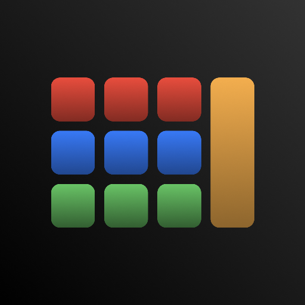

# Nonatone
A nine oscillator drone machine written in Swift, powered by Audiokit, for iOS and iPad, now open source!

## Why?
Nonatone was on sale on the App store for about a year, but understandly (for any app, let alone one as niche as this), interest in it dies down after some time, so when it came time to renew my yearly developer license (something you need to pay to have an app on the app store), I decided it probably wasn't worth it. But rather than letting it disappear, I thought it'd be nice to open source it, hopefully allowing others to learn from it and build their own apps (or even reupload it as-is, it's under MIT license so you can do pretty much whatever you want with it).

Just to note, the primary purpose of this repo is for learning or building, not installing the app as you usually would. I've tried to make it as easy as I can to do that, but a combination of my poor memory of everything I needed to do that originally, and Apple making it quite clear they don't want people installing software from anywhere but their app store, it is a little tricky and will require more work on your end than it would just installing an app from the app store.
Below are my instructions for installation if your determined to do that, just don't expect it to be perfect.

(Just to note, if you previously purchased the app you don't need to bother with this, you can still access it through your previously purchased apps on your Apple account).

## Installation
**Requirements**: A Mac with XCode installed, An Apple developer account (free), the iOS you want to install it to (though you can also install it to your mac), and a cable to connect your Mac to your device.  
Your XCode should also be configured to work with your Apple developer account. Its been a while since I've done this myself so I don't remember exactly how its done, but from what I recall it's pretty much automatic providing you use the same Apple ID as the one you use your Mac with.

1. Clone/download this repository to your Mac, and open it in XCode
2. This parts a little tricky, but not too hard; you'll need to configure the app's signing. Apple won't let you run any app that hasn't be "signed" by a developer, which in this case will be you. With the project open in Xcode, you should see in the top left corner of the file tree "Nonatone" with a little blue icon, and all the folders under it. Click on that, then navigate to "Signing and Capabilities". Assuming your developer account is setup correctly, you should be able to click "Automatically manage signing". To that for both Nonatone and NonatoneAU (under the Targets column to the left).
3. With that done, now it's easy enough. Connect your iOS device to your Mac, and in the top middle of XCode, you should see a little bar which says something along the lines of "Nonatone > My Mac" or maybe "Nonatone > iPhone ..." Click on the device, and you should see your iOS device in the list. Select that.
4. Now, click the run button (top left of XCode, looks like a play button) and after XCode has done it's business, it should be installed and good to go!

Like I say above, I'm working from memory so I'm likely missing a lot of details (you may need to turn on developer settings on your iOS device as well for example). It's obviously not the ideal way to install an app, so you'll likely need to do a bit of Googling to get it all working, but hopefully the above is enough to get you started at least.
